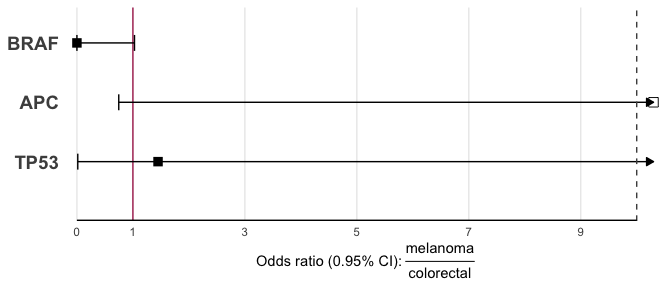

<!-- README.md is generated from README.Rmd. Please edit that file -->

# easyenrich

<!-- badges: start -->

[](https://lifecycle.r-lib.org/articles/stages.html#experimental)
[](https://CRAN.R-project.org/package=easyenrich)
<!-- badges: end -->

Test whether counts of an element differs between 2 groups. For example
identify which genes are present at different rates in lists of ‘mutated
genes’ from two different cohorts. **easyenrich** creates 1 contingency
table for every element in a list of vectors, summarising counts of
their presence/absence in each cohort (represented as the different
vectors in the list). It also runs the fisher test, applies MTC, and
produces forest plots to visualise the results.

## Installation

You can install the development version of easyenrich like so:

``` r
if (!require("remotes"))
    install.packages("remotes")

remotes::install_github("CCICB/easyenrich")
```

## Quick Start

``` r
library(easyenrich)

#Step 1: Create a list of two or more vectors.  
input <- list(
 colorectal = c("APC", "APC", "APC", "TP53", "APC"),
 melanoma = c("BRAF", "BRAF", "BRAF", "BRAF", "BRAF", "TP53", "APC")
)

# Step 2: Create contingency tables
contingency_tables <- list_to_contingency_tables(input)

# Step 3: Compute fisher p values & odds ratios
# Odds ratios can be interpreted as the relative odds of seeing gene <X> in a colorectal cancer VS melanoma (based on order of cohorts in original input list)
comparison <- contingency_tables_to_fisher(contingency_tables)

# Step 4: Sort results based on fdr and print result
comparison[order(comparison$fdr),]
#>   element    p.value odds_ratio conf_level conf.int.lower conf.int.upper
#> 3    BRAF 0.02777778   0.000000       0.95     0.00000000       1.028499
#> 1     APC 0.07196970  15.994914       0.95     0.74734407    1351.222783
#> 2    TP53 1.00000000   1.449105       0.95     0.01532678     136.917687
#>   null.value alternative        fdr present_colorectal absent_colorectal
#> 3          1   two.sided 0.08333333                  0                 5
#> 1          1   two.sided 0.10795455                  4                 1
#> 2          1   two.sided 1.00000000                  1                 4
#>   present_melanoma absent_melanoma total_present total_absent
#> 3                5               2             5            7
#> 1                1               6             5            7
#> 2                1               6             2           10

# Step 5: Visualise Results
plot_rainforest(comparison)
```


